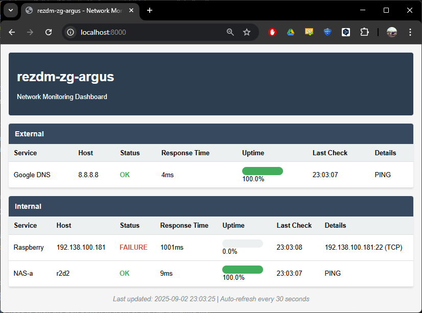

# Argus
Network monitor with web UI

# Preamble
I needed some tool to show on a web page availability of a few selected resources on network, using different protocols. There are tools like Zabbix requiring quote some configuration, and there is something as simple as EasyNetMonitor. 

# Why Java
I did not code with Java for quite some time, so it is a refresher. I also tried to use as least as possible external libraries, there are no frameworks, as raw as possible

# Features
The tool allows to
- Ping (this one is a bit special as I need to call extenal tool, as Java's InetAddress::isReacahble is not usable)
- TCP-connect to a port
- UDP-send a datagramm
- HTTP-get URL

# Screenshot

# Name
Argus Panoptes is an all-seing, watchman creature from Greek mythology
